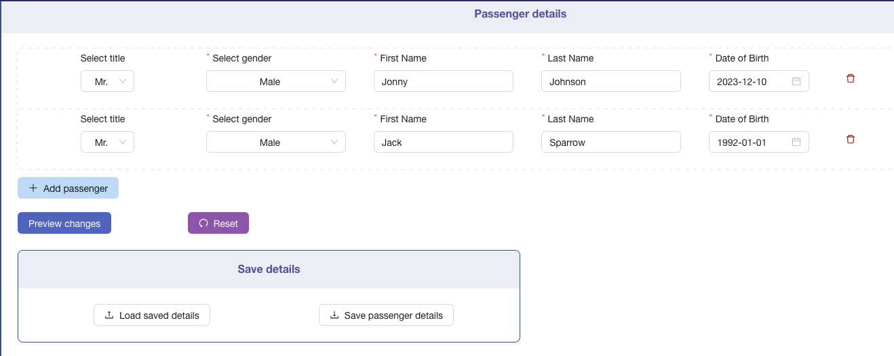
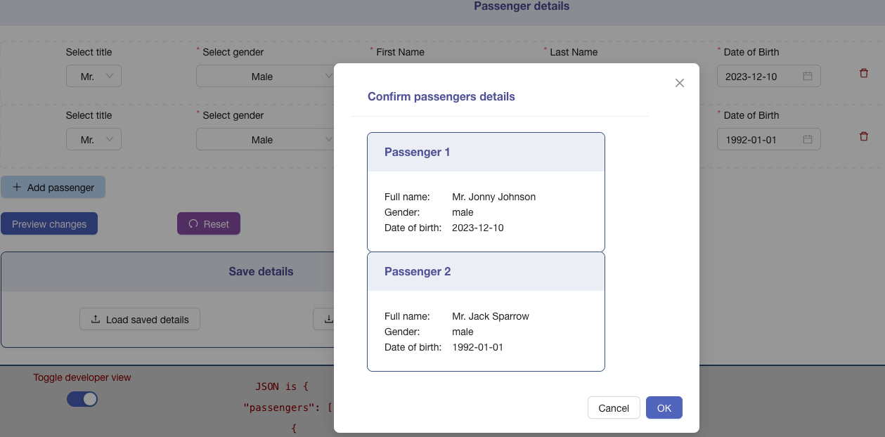
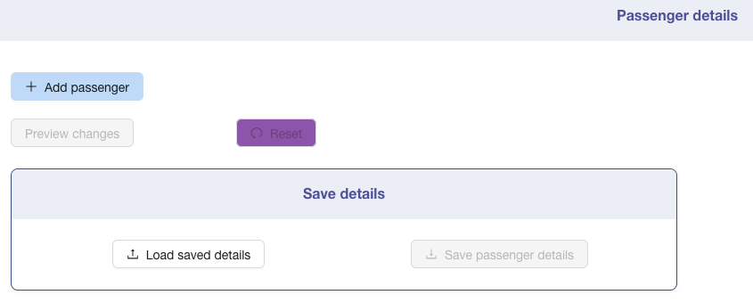
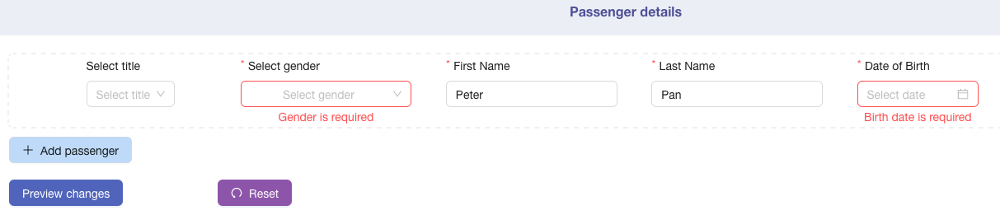
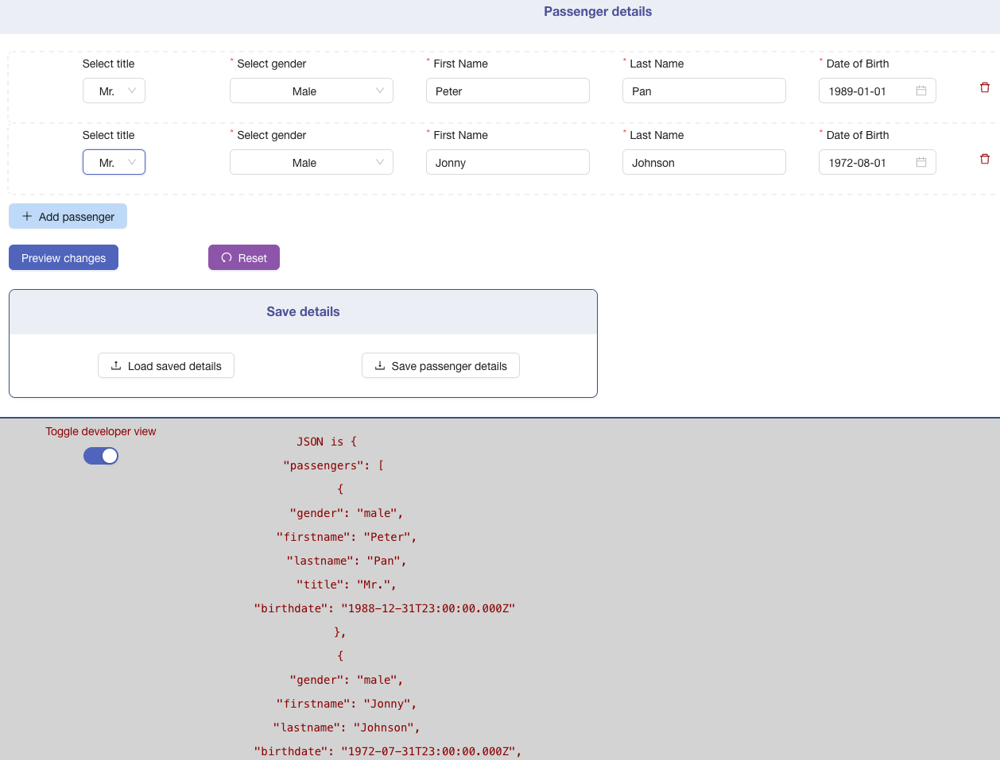
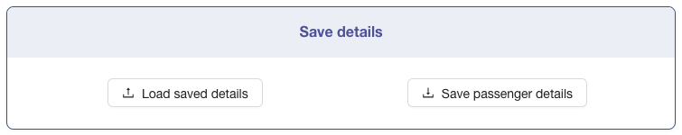

## Case app Passenger Details form

## Using JavaScript, React, Jest, create-react-app

### This app:

- shows mock page
- passenger details form
- allows adding multiple passengers with title, gender, first/last names and birthdate input fields
  
- double opt-in Module preview to check the correctness of entered details
   
  
- disables various buttons based on the state of the form (touched, etc.)
   
  
- form validation for required fields
   
  
- shows the form data object as JSON file (developer view) with live updates
   
  
- Can save current form state as .json file and load it afterward
   
  

## Available Scripts

In the project directory, you can run:

### `npm start`

Runs the app in the development mode.\
Open [http://localhost:4000](http://localhost:3000) to view it in your browser.

### `npm test`

Launches the test runner in the interactive watch mode.

### `npx eslint src`

Checks the linting of all files in /src folder

